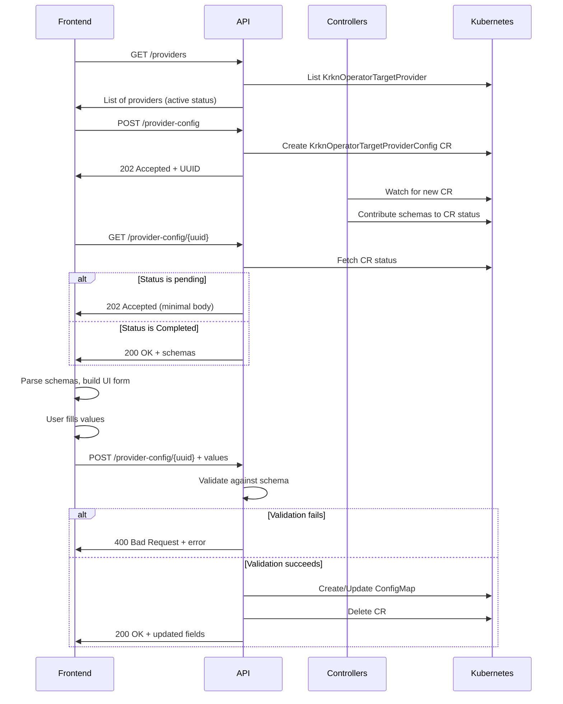

# Provider Configuration API Specification

## Overview

The Provider Configuration API allows clients to configure operator settings through a schema-validated workflow. The system uses `KrknOperatorTargetProviderConfig` Custom Resources (CRs) to collect configuration schemas from multiple operators, validate configuration values, and update ConfigMaps.

## Base URL

```
http://<operator-host>:8080/api/v1
```

---

## API Endpoints

### 1. List Providers

Lists all registered `KrknOperatorTargetProvider` resources with their active status and last heartbeat.

**Endpoint:**
```
GET /providers
```

**Request Headers:**
```http
Content-Type: application/json
```

**Response:**

**Status Code:** `200 OK`

**Response Body:**
```json
{
  "providers": [
    {
      "name": "krkn-operator",
      "active": true,
      "lastHeartbeat": "2026-02-19T10:30:00Z"
    },
    {
      "name": "krkn-operator-acm",
      "active": true,
      "lastHeartbeat": "2026-02-19T10:29:55Z"
    }
  ]
}
```

**Response Fields:**
- `providers` (array): List of registered providers
  - `name` (string): Operator name
  - `active` (boolean): Whether the provider is active
  - `lastHeartbeat` (string, nullable): ISO 8601 timestamp of last heartbeat update (null if never updated)

**Example:**
```bash
curl -X GET http://localhost:8080/api/v1/providers \
  -H "Content-Type: application/json"
```

**Example Response:**
```javascript
const response = await fetch('http://localhost:8080/api/v1/providers');
const { providers } = await response.json();

// Check which providers are active
const activeProviders = providers.filter(p => p.active);
console.log('Active providers:', activeProviders.map(p => p.name));
```

---

### 2. Update Provider Status

Activates or deactivates a provider. Deactivating a provider excludes it from future configuration requests.

**Endpoint:**
```
PATCH /providers/{name}
```

**Path Parameters:**
- `name` (string, required): The provider name (e.g., "krkn-operator", "krkn-operator-acm")

**Request Headers:**
```http
Content-Type: application/json
```

**Request Body:**
```json
{
  "active": false
}
```

**Request Fields:**
- `active` (boolean, required): Set to `true` to activate, `false` to deactivate

**Response:**

**Status Code:** `200 OK`

**Response Body:**
```json
{
  "message": "Provider status updated successfully",
  "name": "krkn-operator-acm",
  "active": false
}
```

**Response Fields:**
- `message` (string): Success message
- `name` (string): Provider name
- `active` (boolean): New active status

**Error Responses:**

**400 Bad Request - Missing provider name:**
```json
{
  "error": "bad_request",
  "message": "Provider name is required"
}
```

**404 Not Found - Provider not found:**
```json
{
  "error": "not_found",
  "message": "Provider not found"
}
```

**500 Internal Server Error:**
```json
{
  "error": "internal_error",
  "message": "Failed to update provider status"
}
```

**Example - Deactivate provider:**
```bash
curl -X PATCH http://localhost:8080/api/v1/providers/krkn-operator-acm \
  -H "Content-Type: application/json" \
  -d '{
    "active": false
  }'
```

**Example - Activate provider:**
```bash
curl -X PATCH http://localhost:8080/api/v1/providers/krkn-operator-acm \
  -H "Content-Type: application/json" \
  -d '{
    "active": true
  }'
```

**Example JavaScript:**
```javascript
const toggleProvider = async (name, active) => {
  const response = await fetch(`http://localhost:8080/api/v1/providers/${name}`, {
    method: 'PATCH',
    headers: {
      'Content-Type': 'application/json'
    },
    body: JSON.stringify({ active })
  });

  if (!response.ok) {
    const error = await response.json();
    throw new Error(error.message);
  }

  return await response.json();
};

// Deactivate a provider
await toggleProvider('krkn-operator-acm', false);
```

---

### 3. Create Provider Config Request

Creates a new `KrknOperatorTargetProviderConfig` CR and initiates the schema collection process from all active providers.

**Endpoint:**
```
POST /provider-config
```

**Request Headers:**
```http
Content-Type: application/json
```

**Request Body:**
```json
{}
```
*Note: Empty body - no parameters required*

**Response:**

**Status Code:** `202 Accepted`

**Response Body:**
```json
{
  "uuid": "03d6854e-eb75-4d01-b7c8-6f5d6f57f10c"
}
```

**Response Fields:**
- `uuid` (string): Unique identifier for this config request. Use this UUID for subsequent API calls.

**Example:**
```bash
curl -X POST http://localhost:8080/api/v1/provider-config \
  -H "Content-Type: application/json"
```

---

### 2. Get Provider Config Status

Retrieves the current status of a provider config request, including all contributed schemas from active providers.

**Endpoint:**
```
GET /provider-config/{uuid}
```

**Path Parameters:**
- `uuid` (string, required): The UUID returned from the creation endpoint

**Request Headers:**
```http
Content-Type: application/json
```

**Response:**

**Status Code:** `202 Accepted` (when pending) or `200 OK` (when completed)

**Response Body (Pending):**
```http
HTTP/1.1 202 Accepted
Content-Type: application/json

{
  "uuid": "550e8400-e29b-41d4-a716-446655440000",
  "status": "pending"
}
```
*Minimal body when pending - providers are still contributing schemas*

**Response Body (Completed):**
```json
{
  "uuid": "03d6854e-eb75-4d01-b7c8-6f5d6f57f10c",
  "status": "Completed",
  "config_data": {
    "krkn-operator": {
      "config-map": "krkn-operator-config",
      "namespace": "krkn-operator-system",
      "config-schema": "{\"type\":\"object\",\"properties\":{\"api\":{\"type\":\"object\",\"properties\":{\"port\":{\"type\":\"number\",\"description\":\"Port for the REST API server\",\"default\":8080},\"enabled\":{\"type\":\"boolean\",\"description\":\"Whether the REST API is enabled\",\"default\":true}}},\"scenarios\":{\"type\":\"object\",\"properties\":{\"default-timeout\":{\"type\":\"string\",\"description\":\"Default timeout for scenario execution\",\"default\":\"600s\",\"pattern\":\"^[0-9]+(s|m|h)$\"}}},\"provider\":{\"type\":\"object\",\"properties\":{\"heartbeat-interval\":{\"type\":\"string\",\"description\":\"Interval for provider heartbeat updates\",\"default\":\"30s\",\"pattern\":\"^[0-9]+(s|m|h)$\"}}}}}"
    },
    "krkn-operator-acm": {
      "config-map": "krkn-operator-acm-config",
      "namespace": "krkn-operator-system",
      "config-schema": "[{\"name\":\"ACM_SECRET_LOCAL_CLUSTER\",\"type\":3,\"default\":\"application-manager\",\"required\":true}]"
    }
  }
}
```

**Response Fields:**
- `uuid` (string): The unique identifier for this config request
- `status` (string): Current status - `"pending"` or `"Completed"`
- `config_data` (object): Map of provider-name to provider configuration data
  - `config-map` (string): Name of the ConfigMap to update
  - `namespace` (string): Kubernetes namespace where the ConfigMap is located
  - `config-schema` (string): JSON schema as a string (needs to be parsed)

**Error Responses:**

**404 Not Found:**
```json
{
  "error": "not_found",
  "message": "KrknOperatorTargetProviderConfig not found"
}
```

**Example:**
```bash
curl -X GET http://localhost:8080/api/v1/provider-config/03d6854e-eb75-4d01-b7c8-6f5d6f57f10c \
  -H "Content-Type: application/json"
```

---

### 3. Update Provider Configuration

Updates a provider's ConfigMap with validated configuration values based on the schema. **After successful update, the KrknOperatorTargetProviderConfig CR is automatically deleted.**

**Endpoint:**
```
POST /provider-config/{uuid}
```

**Path Parameters:**
- `uuid` (string, required): The UUID of the config request

**Request Headers:**
```http
Content-Type: application/json
```

**Request Body:**
```json
{
  "provider_name": "krkn-operator",
  "values": {
    "api.port": "9090",
    "api.enabled": "true",
    "scenarios.default-timeout": "300s",
    "provider.heartbeat-interval": "60s"
  }
}
```

**Request Fields:**
- `provider_name` (string, required): Name of the provider whose config to update (must match a key in `config_data`)
- `values` (object, required): Map of configuration keys to string values
  - Keys use dot notation for nested fields (e.g., `"api.port"`)
  - **All values must be strings** (including numbers and booleans: `"9090"`, `"true"`, `"false"`)
  - Values are validated against the type specified in the provider's JSON schema

**Response:**

**Status Code:** `200 OK`

**Response Body:**
```json
{
  "message": "Configuration updated successfully",
  "updatedFields": [
    "api.port",
    "api.enabled",
    "scenarios.default-timeout",
    "provider.heartbeat-interval"
  ]
}
```

**Response Fields:**
- `message` (string): Success message
- `updatedFields` (array of strings): List of fields that were successfully updated

**Error Responses:**

**400 Bad Request - Missing provider_name:**
```json
{
  "error": "bad_request",
  "message": "provider_name is required"
}
```

**400 Bad Request - Empty values:**
```json
{
  "error": "bad_request",
  "message": "values cannot be empty"
}
```

**404 Not Found - Config request not found:**
```json
{
  "error": "not_found",
  "message": "KrknOperatorTargetProviderConfig not found"
}
```

**404 Not Found - Provider not found:**
```json
{
  "error": "not_found",
  "message": "target provider: krkn-operator-xyz not found"
}
```

**400 Bad Request - Field not in schema:**
```json
{
  "error": "bad_request",
  "message": "field invalid.field not found in schema"
}
```

**400 Bad Request - Validation error:**
```json
{
  "error": "bad_request",
  "message": "failed to validate api.port: \"not-a-number\" - (root).api.port: Invalid type. Expected: number, given: string"
}
```

**500 Internal Server Error:**
```json
{
  "error": "internal_error",
  "message": "Failed to update ConfigMap"
}
```

**Example:**
```bash
curl -X POST http://localhost:8080/api/v1/provider-config/03d6854e-eb75-4d01-b7c8-6f5d6f57f10c \
  -H "Content-Type: application/json" \
  -d '{
    "provider_name": "krkn-operator",
    "values": {
      "api.port": 9090,
      "api.enabled": true,
      "scenarios.default-timeout": "300s"
    }
  }'
```

---

## Complete Workflow

### Step-by-Step Flow



### 1. List Available Providers (Optional)

```javascript
const response = await fetch('http://localhost:8080/api/v1/providers');
const { providers } = await response.json();

console.log('Available providers:', providers);
// Show list to user, allow enable/disable
```

### 2. Create Config Request

```javascript
const response = await fetch('http://localhost:8080/api/v1/provider-config', {
  method: 'POST',
  headers: {
    'Content-Type': 'application/json'
  }
});

const { uuid } = await response.json();
console.log('Config request UUID:', uuid);
```

### 3. Poll for Completion

```javascript
const checkStatus = async (uuid) => {
  const response = await fetch(`http://localhost:8080/api/v1/provider-config/${uuid}`, {
    headers: {
      'Content-Type': 'application/json'
    }
  });

  if (response.status === 100) {
    // Still pending, wait and retry
    await new Promise(resolve => setTimeout(resolve, 2000));
    return checkStatus(uuid);
  }

  if (response.status === 200) {
    const data = await response.json();
    return data;
  }

  throw new Error('Failed to get config status');
};

const configData = await checkStatus(uuid);
console.log('Providers:', Object.keys(configData.config_data));
```

### 4. Parse Schemas and Build UI

```javascript
// Example: Parse krkn-operator schema
const krknOperatorSchema = JSON.parse(configData.config_data['krkn-operator']['config-schema']);

// Example schema structure:
// {
//   "type": "object",
//   "properties": {
//     "api": {
//       "type": "object",
//       "properties": {
//         "port": { "type": "number", "default": 8080 },
//         "enabled": { "type": "boolean", "default": true }
//       }
//     },
//     "scenarios": { ... }
//   }
// }

// Build form fields dynamically from schema
const buildFormFields = (schema) => {
  const fields = [];

  for (const [key, prop] of Object.entries(schema.properties)) {
    if (prop.type === 'object' && prop.properties) {
      // Nested object - recurse
      for (const [nestedKey, nestedProp] of Object.entries(prop.properties)) {
        fields.push({
          name: `${key}.${nestedKey}`,
          type: nestedProp.type,
          description: nestedProp.description,
          default: nestedProp.default,
          pattern: nestedProp.pattern
        });
      }
    } else {
      fields.push({
        name: key,
        type: prop.type,
        description: prop.description,
        default: prop.default
      });
    }
  }

  return fields;
};

const formFields = buildFormFields(krknOperatorSchema);
```

### 5. Submit Configuration

```javascript
const submitConfig = async (uuid, providerName, values) => {
  const response = await fetch(`http://localhost:8080/api/v1/provider-config/${uuid}`, {
    method: 'POST',
    headers: {
      'Content-Type': 'application/json'
    },
    body: JSON.stringify({
      provider_name: providerName,
      values: values
    })
  });

  if (!response.ok) {
    const error = await response.json();
    throw new Error(error.message);
  }

  const result = await response.json();
  console.log('Updated fields:', result.updatedFields);
  return result;
};

// Example usage
try {
  await submitConfig(uuid, 'krkn-operator', {
    'api.port': 9090,
    'api.enabled': true,
    'scenarios.default-timeout': '300s',
    'provider.heartbeat-interval': '60s'
  });
  console.log('Configuration updated successfully!');
} catch (error) {
  console.error('Failed to update configuration:', error.message);
}
```

---

## Schema Examples

### krkn-operator Schema

```json
{
  "type": "object",
  "properties": {
    "api": {
      "type": "object",
      "properties": {
        "port": {
          "type": "number",
          "description": "Port for the REST API server",
          "default": 8080
        },
        "enabled": {
          "type": "boolean",
          "description": "Whether the REST API is enabled",
          "default": true
        }
      }
    },
    "scenarios": {
      "type": "object",
      "properties": {
        "default-timeout": {
          "type": "string",
          "description": "Default timeout for scenario execution",
          "default": "600s",
          "pattern": "^[0-9]+(s|m|h)$"
        }
      }
    },
    "provider": {
      "type": "object",
      "properties": {
        "heartbeat-interval": {
          "type": "string",
          "description": "Interval for provider heartbeat updates",
          "default": "30s",
          "pattern": "^[0-9]+(s|m|h)$"
        }
      }
    }
  }
}
```

### krkn-operator-acm Schema (Custom Format)

```json
[
  {
    "name": "ACM_SECRET_LOCAL_CLUSTER",
    "short_description": "Secret for local-cluster",
    "description": "Select the secret to use for cluster local-cluster authentication. Available secrets: application-manager, klusterlet-addon-workmgr-log",
    "variable": "ACM_SECRET_LOCAL_CLUSTER",
    "type": 3,
    "default": "application-manager",
    "separator": ",",
    "allowed_values": "application-manager,klusterlet-addon-workmgr-log",
    "required": true
  }
]
```

*Note: krkn-operator-acm uses a custom schema format (array of field definitions) instead of JSON Schema. Frontend needs to handle both formats.*

---

## Validation Rules

### Field Types

- `number`: Must be a numeric value (integer or float)
- `boolean`: Must be `true` or `false`
- `string`: Text value, may have pattern validation

### Pattern Validation

For fields with `pattern` property, the value must match the regex:

**Example:** `"pattern": "^[0-9]+(s|m|h)$"`
- Valid: `"30s"`, `"5m"`, `"2h"`, `"600s"`
- Invalid: `"30"`, `"abc"`, `"30sec"`

### Nested Fields

Use dot notation to specify nested fields:
- Schema: `{ "api": { "properties": { "port": {...} } } }`
- Field name in request: `"api.port"`

### Required vs Optional

Fields without a `default` value in the schema may be required. Check the provider's specific schema for requirements.

---

## Error Handling

### Common Error Patterns

**Network Errors:**
```javascript
try {
  const response = await fetch(url);
  if (!response.ok) {
    throw new Error(`HTTP ${response.status}`);
  }
} catch (error) {
  if (error.message.includes('Failed to fetch')) {
    // Network error - operator might be down
    console.error('Cannot connect to operator');
  }
}
```

**Validation Errors:**
```javascript
const response = await fetch(url, { method: 'POST', body: ... });
if (response.status === 400) {
  const error = await response.json();
  if (error.message.includes('not found in schema')) {
    // Field doesn't exist in schema
    console.error('Invalid field name');
  } else if (error.message.includes('failed to validate')) {
    // Type or pattern validation failed
    console.error('Invalid value:', error.message);
  }
}
```

**Timeout Handling:**
```javascript
// Add timeout to polling
const checkStatusWithTimeout = async (uuid, maxWaitMs = 30000) => {
  const startTime = Date.now();

  while (Date.now() - startTime < maxWaitMs) {
    const response = await fetch(`/api/v1/provider-config/${uuid}`);

    if (response.status === 200) {
      return await response.json();
    }

    if (response.status === 100) {
      await new Promise(resolve => setTimeout(resolve, 2000));
      continue;
    }

    throw new Error(`Unexpected status: ${response.status}`);
  }

  throw new Error('Timeout waiting for config completion');
};
```

---

## Testing

### Manual Testing

**Create and complete workflow:**
```bash
# 1. Create config request
UUID=$(curl -s -X POST http://localhost:8080/api/v1/provider-config | jq -r '.uuid')
echo "UUID: $UUID"

# 2. Wait for completion
sleep 5

# 3. Check status
curl -X GET "http://localhost:8080/api/v1/provider-config/$UUID" | jq .

# 4. Update config
curl -X POST "http://localhost:8080/api/v1/provider-config/$UUID" \
  -H "Content-Type: application/json" \
  -d '{
    "provider_name": "krkn-operator",
    "values": {
      "api.port": 9090,
      "scenarios.default-timeout": "300s"
    }
  }' | jq .
```

**Test validation errors:**
```bash
# Invalid field
curl -X POST "http://localhost:8080/api/v1/provider-config/$UUID" \
  -H "Content-Type: application/json" \
  -d '{
    "provider_name": "krkn-operator",
    "values": {
      "invalid.field": "value"
    }
  }' | jq .

# Invalid type
curl -X POST "http://localhost:8080/api/v1/provider-config/$UUID" \
  -H "Content-Type: application/json" \
  -d '{
    "provider_name": "krkn-operator",
    "values": {
      "api.port": "not-a-number"
    }
  }' | jq .
```

---

## Notes for Frontend Implementation

1. **Polling Strategy**: Status endpoint returns `202 Accepted` when pending and `200 OK` when completed. Poll every 2-3 seconds with a maximum timeout (e.g., 30 seconds).

2. **Schema Parsing**: Be prepared to handle multiple schema formats:
   - JSON Schema (krkn-operator): Standard JSON Schema with `type`, `properties`, etc.
   - Custom formats (krkn-operator-acm): Array of field definitions

3. **Form Validation**: Validate on the frontend before submission:
   - Type checking (number, boolean, string)
   - Pattern matching for string fields
   - Required field validation

4. **Error Display**: Show user-friendly error messages:
   - "Field not found" → "This configuration option is not available"
   - "Invalid type" → "Please enter a number"
   - "Pattern mismatch" → "Format must be like: 30s, 5m, or 2h"

5. **Auto-cleanup**: The CR is automatically deleted after successful update. Don't attempt to re-use the same UUID after a successful update.

6. **Multi-provider Support**: A single config request can update multiple providers. Submit separate update requests for each provider.

---

## Change Log

- **v1.1** (2026-02-19): Added provider management endpoints
  - GET /providers - List all registered providers
  - PATCH /providers/{name} - Activate/deactivate provider

- **v1.0** (2026-02-19): Initial specification
  - POST /provider-config - Create config request
  - GET /provider-config/{uuid} - Get config status
  - POST /provider-config/{uuid} - Update provider config
  - Auto-deletion of CR after successful update
